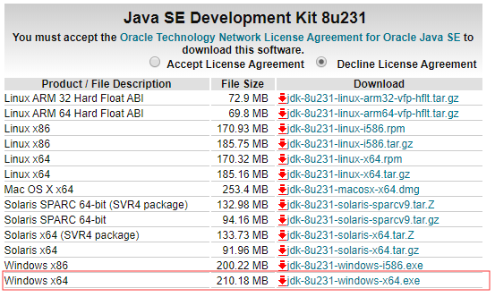
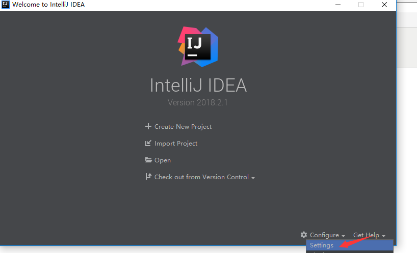
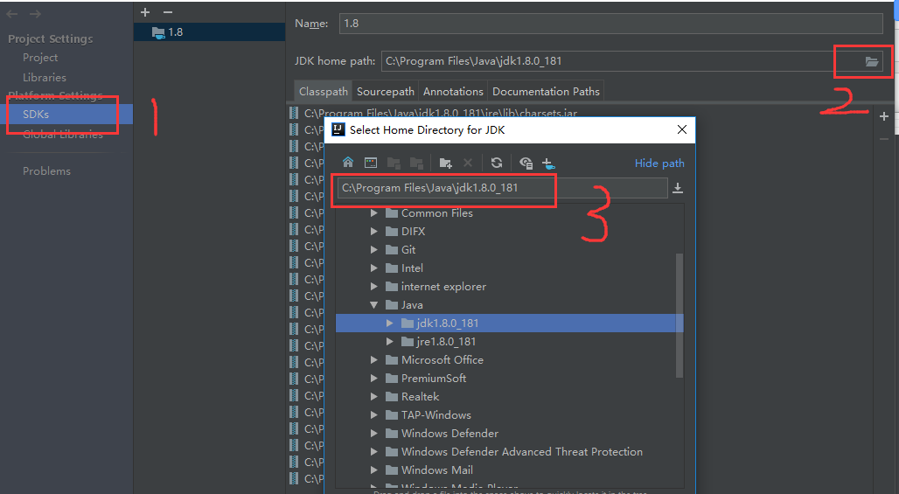
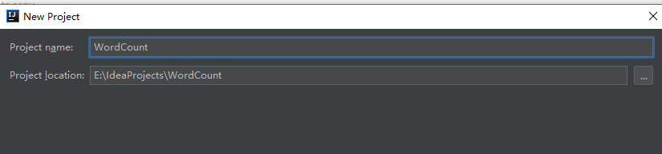
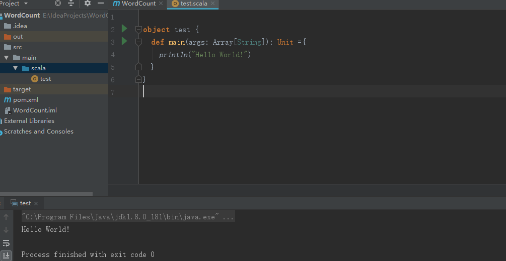
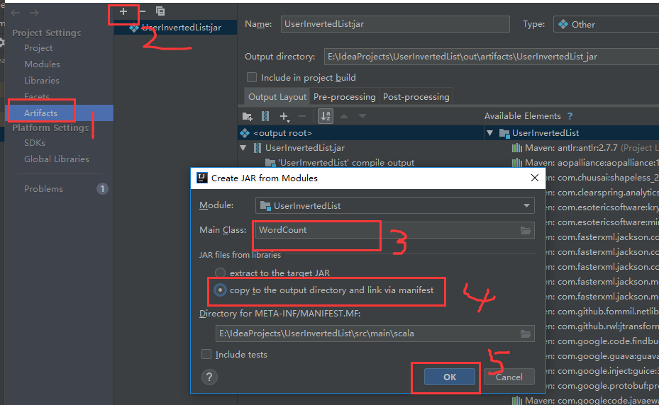
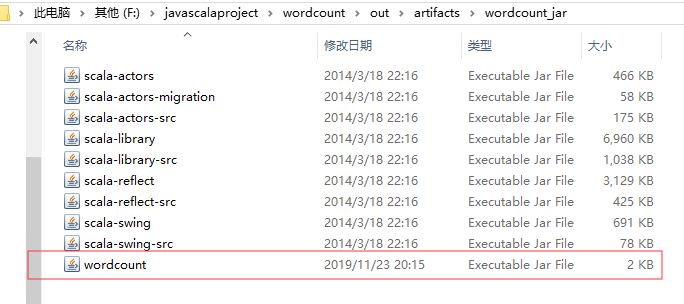
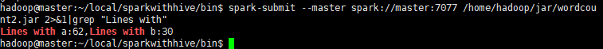

# 集群使用手册（上）

## 目录

[一、直接将.py文件提交到spark集群执行 ](ji-qun-shi-yong-shou-ce-shang.md#yi-zhi-jie-jiang-py-wen-jian-ti-jiao-dao-spark-ji-qun-zhi-hang)

[二、Maven&Intellij IDEA打jar包以及创建scala project ](ji-qun-shi-yong-shou-ce-shang.md#er-mavenintellij-idea-da-jar-bao-yi-ji-chuang-jian-scala-project)

[1. Intellij IDEA+maven搭建scala环境: ](ji-qun-shi-yong-shou-ce-shang.md#1-intellij-ideamaven-da-jian-scala-huan-jing)

[2. 安装intellij-idea ](ji-qun-shi-yong-shou-ce-shang.md#2-an-zhuang-intellijidea)

[3. scala插件安装 ](ji-qun-shi-yong-shou-ce-shang.md#2-an-zhuang-intellijidea)

[4. 设置全局JDK和Scala SDK](ji-qun-shi-yong-shou-ce-shang.md#4-she-zhi-quan-ju-jdk-he-scala-sdk) 

[5、创建maven工程 ](ji-qun-shi-yong-shou-ce-shang.md#5-chuang-jian-maven-gong-cheng)

[三、Intellij IDEA打包scala代码在spark中运行： ](ji-qun-shi-yong-shou-ce-shang.md#san-intellij-idea-da-bao-scala-dai-ma-zai-spark-zhong-yun-hang)

[1、修改pom.xml文件](ji-qun-shi-yong-shou-ce-shang.md#1-xiu-gai-pomxml-wen-jian) 

[2、编写一个Scala程序，统计字母的行数 ](ji-qun-shi-yong-shou-ce-shang.md#2-bian-xie-yi-ge-scala-cheng-xu-tong-ji-zi-mu-de-hang-shu)

[3、打包代码](ji-qun-shi-yong-shou-ce-shang.md#3-da-bao-dai-ma) 

[4、运行在spark集群上面](ji-qun-shi-yong-shou-ce-shang.md#4-yun-hang-zai-spark-ji-qun-shang-mian) 

[四、Spark集群的三种部署方式 ](ji-qun-shi-yong-shou-ce-shang.md#si-spark-ji-qun-de-san-zhong-bu-shu-fang-shi)

## 一、直接将.py文件提交到spark集群执行

`hadoop@master:~/local/sparkwithhive/bin$ spark-submit --master spark://master:7077 /home/hadoop/pycode/pytest.py`

例：Pytest.py

```text
from pyspark import SparkContext,SparkConf
conf=SparkConf().setAppName("sparkDemo").setMaster("master")
sc=SparkContext(conf=conf)
logFile='file:///home/hadoop/local/sparkwithhive/README.md'
logData=sc.textFile(logFile).cache()
numAs = logData.filter(lambda s: 'a' in s).count()
numBs = logData.filter(lambda s: 'b' in s).count()
print("Lines with a: %i, lines with b: %i" % (numAs, numBs))
```

注：textFile\(\)默让是在HDFS中查找文件，所以只给一个文件目录则会在HDFS中查找文件，请先确保你所加载的文件在HDFS中。

例如：`var rdd = sc.textFile("/Filename.txt")`等价于`var rdd = sc.textFile(“hdfs:///Filename.txt”)`是在HDFS中查找文件，请将文件用put上传到HDFS或确保该文件在hdfs://中。

若想用本地文件创建rdd，则应在目录前加入“file://” 例如：var rdd = sc.textFile\(“file:///Filename.txt”\)

运行成功：


## 二、Maven&Intellij IDEA打jar包以及创建scala project

### 1. Intellij IDEA+maven搭建scala环境:

[https://www.cnblogs.com/654wangzai321/p/9513366.html](https://www.cnblogs.com/654wangzai321/p/9513366.html)

#### 1.1 安装JDK

a.下载jdk-8u231-windows-x64安装包：

[https://www.oracle.com/technetwork/java/javase/downloads/jdk8-downloads-2133151.html](https://www.oracle.com/technetwork/java/javase/downloads/jdk8-downloads-2133151.html)

打开界面之后，先选中Accept License Agreement，然后下载jdk-8u231-windows-x64.exe



b. 然后加入到环境变量

### 2. 安装intellij-idea

下载地址：

[https://download.jetbrains.8686c.com/idea/ideaIU-2018.2.1.exe](https://download.jetbrains.8686c.com/idea/ideaIU-2018.2.1.exe)

[https://www.jetbrains.com/idea/download/\#section=windows](https://www.jetbrains.com/idea/download/#section=windows)

### 3. scala插件安装

打开激活的idea，然后点configure-&gt;settings-&gt;plugins，然后直接搜索scala，安装即可




### 4. 设置全局JDK和Scala SDK

#### 4.1 设置全局JDK，configure-&gt;project defaults-&gt;project structure -&gt;SDKs




选择刚刚安装的jdk的路径。

#### 4.2设置Scala SDK，configure-&gt;project defaults-&gt;project structure -&gt;global libraries -&gt; + -&gt;Scala SDK


### 5、创建maven工程

a. 下载地址：[http://mirrors.hust.edu.cn/apache/maven/maven-3/3.5.4/binaries/apache-maven-3.5.4-bin.zip](http://mirrors.hust.edu.cn/apache/maven/maven-3/3.5.4/binaries/apache-maven-3.5.4-bin.zip)

b. 加入到环境变量

c. 创建一个新的maven工程，选择JDK，然后next，GroupID和ArtifactId可以命名，然后next，finish




创建完成后，将Scala的框架添加到这个项目中，方法为：

在项目名称上右键菜单中点击Add Framework Support...，然后在打开的对话框左侧边栏中，勾选Scala前面的复选框，然后点击确定即可


把这三个文件夹都删掉，在main文件夹中建立一个名为 scala 的文件夹，并右键点击 scala 文件夹，选择 Make Directory as，然后选择Sources Root ，这里主要意思是将 scala 文件夹标记为一个源文件的根目录，然后在其内的所有代码中的 package ，其路径就从这个根目录下开始算起。

在已经标记好为源文件根目录的 scala 文件夹 上，右键选择 New，然后选择 Scala Class，随后设置好程序的名称，并且记得将其设置为一个 Object\(类似于Java中含有静态成员的静态类\)，正常的话，将会打开这个 Object 代码界面，并且可以看到IntelliJ IDEA自动添加了一些最基本的信息 

在test.scala中添加如下代码：

```text
object test {
 def main(args: Array[String]): Unit ={
 println("Hello World!")
 }}
```

运行，效果如图：



## 三、Intellij IDEA打包scala代码在spark中运行：

[https://www.cnblogs.com/654wangzai321/p/9513488.html](https://www.cnblogs.com/654wangzai321/p/9513488.html)

### 1、修改pom.xml文件

创建好Maven项目之后（记得添加Scala框架到该项目），修改pom.xml文件，添加如下内容：

```text
<name>secondscala</name>
<url>http://maven.apache.org</url>
<properties>
 <project.build.sourceEncoding>UTF-8</project.build.sourceEncoding>
</properties>
<dependencies>
 <dependency>
 <groupId>junit</groupId>
 <artifactId>junit</artifactId>
 <version>3.8.1</version>
 <scope>test</scope>
 </dependency>
 <!-- https://mvnrepository.com/artifact/org.apache.spark/spark-core -->
 <dependency>
 <groupId>org.apache.spark</groupId>
 <artifactId>spark-core_2.10</artifactId>
 <version>2.1.0</version>
 </dependency>
</dependencies>
```

其中保存之后，需要点击右下角的import change，这样相当于是下载jar包

### 2、编写一个Scala程序，统计字母的行数

```text
import org.apache.spark.SparkContext
import org.apache.spark.SparkContext._
import org.apache.spark.SparkConf
object SimpleApp {
 def main(args:Array[String]): Unit ={
 val logFile="file:///home/hadoop/local/sparkwithhive/README.md"
 val conf = new SparkConf().setAppName("Simple Application")
 val sc = new SparkContext(conf)
 val logData = sc.textFile(logFile,2).cache()
 val numAs = logData.filter(line =>line.contains("a")).count()
 val numBs = logData.filter(line =>line.contains("b")).count()
 println("Lines with a:%s,Lines with b:%s".format(numAs,numBs))
 }
}
```

### 3、打包代码

file-&gt;Porject Structure-&gt;Artifacts-&gt;加号-&gt;JAR-&gt;from modules...

然后填写定义的类名，选择copy to..选项（打包这一个类）



点击ok之后，然后build-&gt;build Artifacts-&gt;build，等待build完成。然后可以在项目的这个目录中找到刚刚打包的这个jar包



### 4、运行在spark集群上面

a. 把jar包放到能访问spark集群的机器上面

b. 运行

`hadoop@master:~/local/sparkwithhive/bin$ spark-submit --master` [`spark://master:7077`](spark://master:7077/) `/home/hadoop/jar/wordcount2.jar 2>&1|grep "Lines with"`  


c. 结果



## 四、Spark集群的三种部署方式

[详见另一参考文档](ji-qun-shi-yong-shou-ce-xia.md)

