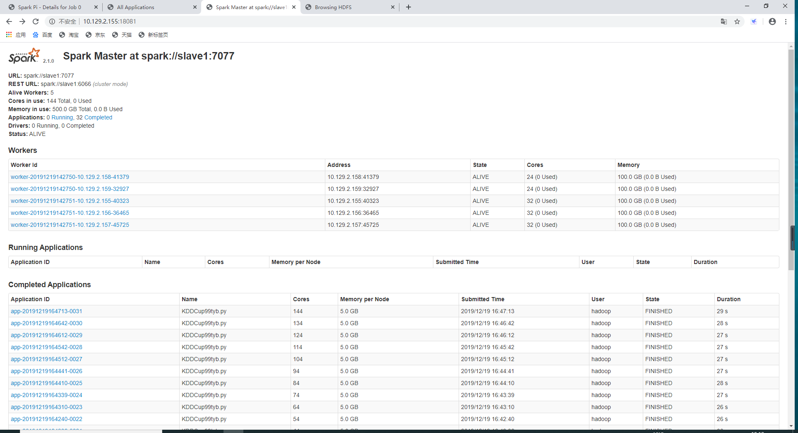

# Spark && hive 搭建指南

本页主要介绍spark是如何安装的，spark的集群模式安装依赖hadoop，因此要先安装完hadoop，如果对hadoop安装有问题，可参考[hadoop搭建指南](../hadoop.md)。

本次安装的spark是经过编译的版本，因为spark，hive，hadoop这类工具对版本匹配度较高，过高版本的spark支持hive，需要自己编译源码。本次采用的是别人直接编译过的支持hive的版本。

hive的安装依赖mysql，需要先安装mysql，尽量选择联网的情况下安装

## 目录

[**1 项目简介** ](./#xiang-mu-jian-jie)\*\*\*\*

[**2 Spark搭建**](./#2spark-da-jian) ****

\*\*\*\*[**3 Hive安装**](./#3hive-an-zhuang) 

\*\*\*\*[**4 Mysql安装**](./#4mysql-an-zhuang)  

\*\*\*\*[**5 Hive && spark**](./#5-hive-and-and-spark) 

\*\*\*\*[**6 计算平台验证**](./#6-ji-suan-ping-tai-yan-zheng) 

\*\*\*\*[**7 参考资料** ](./#can-kao-zi-liao)\*\*\*\*

## 1.项目简介

### 1.1Spark简介

Spark最初由美国加州伯克利大学（UCBerkeley）的AMP实验室于2009年开发，是基于内存计算的大数据并行计算框架，可用于构建大型的、低延迟的数据分析应用程序

### 1.2主要特点与优点

* 运行速度快：使用DAG执行引擎以支持循环数据流与内存计算
* 容易使用：支持使用Scala、Java、Python和R语言进行编程，可以通过Spark Shell进行交互式编程
* 通用性：Spark提供了完整而强大的技术栈，包括SQL查询、流式计算、机器学习和图算法组件
* 运行模式多样：可运行于独立的集群模式中，可运行于Hadoop中，也可运行于Amazon EC2等云环境中，并且可以访问HDFS、Cassandra、HBase、Hive等多种数据源

### 1.3Spark生态系统

Spark的生态系统主要包含了Spark Core、Spark SQL、Spark Streaming、MLLib和GraphX 等组件


## 2.Spark搭建

Spark的安装建立在hadoop的基础上，之前的一些基础配置就不再重复，请先完成hadoop集群的安装，再安装spark。

### 2.1Spark安装主要任务

* 下载，上传服务器安装包；

• Spark配置集群，配置 `~/.bashrc、conf/slaves`以及`conf/spark-env.sh`

• 直接启动验证，通过jps和宿主机浏览器验证

• 启动spark-shell客户端，通过宿主机浏览器验证

### 2.2修改配置文件

* `Vim ~/.bashrc`
* 定义`SPARK_HOME`并把spark路径加入到PATH参数中

```text
export SPARK_HOME=/opt/app/spark-2.2.0-bin-hadoop2.7
export PATH=PATH:PATH:SPARK_HOME/bin:$SPARK_HOME/sbin
```

### 2.3配置conf/slaves

进入spark目录下

* 打开配置文件`conf/slaves`，默认情况下没有slaves，需要使用cp命令复制`slaves.template`

```text
# cp slaves.template slaves
# vim slaves
```

* 加入slaves配置节点s`lave1-4,master`

```text
Slave1
Slave2
```

### 2.4配置conf/spark-env.sh

* 打开配置文件conf/slaves，默认情况下没有slaves，需要使用cp命令复制`spark-env.sh.template spark-env.sh`

```text
# cp spark-env.sh.template spark-env.sh
# vim spark-env.sh
```

* 加入如下环境配置内容，设置slave1为Master节点

```text
export JAVA_HOME=/usr/lib/java/jdk1.8.0_221
export SPARK_MASTER_IP=slave1
export SPARK_MASTER_PORT=7077
export SPARK_WORKER_CORES=32
export SPARK_WORKER_INSTANCES=1
export SPARK_WORKER_MEMORY=100G
```

### 2.5启动spark

* `Start-master.sh`
* `Start-slaves.sh`
* Slave1节点上的进程有：


* 其余节点上的进程有：


## 3.Hive安装

### 3.1配置环境变量

为了方便使用，我们把hive命令加入到环境变量中去，编辑`~/.bashrc`文件`vim ~/.bashrc`，在最前面一行添加:

```text
export HIVE_HOME=/usr/local/hive
export PATH=$PATH:$HIVE_HOME/bin
```

### 3.2配置conf/hive-site.xml

将`hive-default.xml.template`重命名为`hive-default.xml`；新建一个文件t`ouch hive-site.xml`，并在`hive-site.xml`中粘贴如下配置信息：

```text
<?xml version="1.0" encoding="UTF-8" standalone="no"?>
<?xml-stylesheet type="text/xsl" href="configuration.xsl"?>
<configuration>
 <property>
 <name>javax.jdo.option.ConnectionURL</name>
 <value>jdbc:mysql://localhost:3306/hive?createDatabaseIfNotExist=true</value>
 <description>JDBC connect string for a JDBC metastore</description>
 </property>
 <property>
 <name>javax.jdo.option.ConnectionDriverName</name>
 <value>com.mysql.jdbc.Driver</value>
 <description>Driver class name for a JDBC metastore</description>
 </property>
 <property>
 <name>javax.jdo.option.ConnectionUserName</name>
 <value>hive</value>
 <description>username to use against metastore database</description>
 </property>
 <property>
 <name>javax.jdo.option.ConnectionPassword</name>
<value>hive</value>
<description>password to use against metastore database</description>
 </property>
</configuration>
```

## 4.Mysql安装

### 4.1Ubuntu下安装mysql

使用以下命令即可进行mysql安装，注意安装前先更新一下软件源以获得最新版本：

```text
sudo apt-get update #更新软件源
sudo apt-get install mysql-server #安装mysql
```

### 4.2测试是否mysql安装成功

* 启动和关闭mysql服务器：

```text
service mysql start
service mysql stop
```

* 确认是否启动成功，mysql节点处于LISTEN状态表示启动成功：

```text
udo netstat -tap | grep mysql
```

### 4.3Mysql与hive配置

* 下载mysql jdbc 包
* 启动并登陆mysql shell

```text
service mysql start #启动mysql服务
mysql -u root -p #登陆shell界面
```

* 新建hive数据库

```text
mysql> create database hive;
```

* 配置mysql允许hive接入

```text
mysql> grant all on *.* to hive@localhost identified by 'hive'; #将所有数据库的所有表的所有权限赋给hive用户，后面的hive是配置hive-site.xml中配置的连接密码
mysql> flush privileges; #刷新mysql系统权限关系表
```

* 启动hive

```text
start-all.sh #启动hadoop
hive #启动hive
```

## 5.Hive && spark

为了让Spark能够访问Hive，必须为Spark添加Hive支持。Spark官方提供的预编译版本，通常是不包含Hive支持的，需要采用源码编译，编译得到一个包含Hive支持的Spark版本。如果你当前电脑上的Spark版本不包含Hive支持，请根据下面教程编译一个包含Hive支持的Spark版本。

为了让Spark能够访问Hive，需要把Hive的配置文件`hive-site.xml`拷贝到Spark的conf目录下，请在Shell命令提示符状态下操作：

```text
cd /usr/local/sparkwithhive/conf
cp /usr/local/hive/conf/hive-site.xml 
```

### 5.1Spark on hive

* 启动进入`spark-shell`，命令如下：

```text
cd /usr/local/sparkwithhive
./bin/spark-shell
```

* 启动了`spark-shell`，进入了“scala&gt;”命令提示符状态，请输入下面语句：

```text
scala> import org.apache.spark.sql.hive.HiveContext
import org.apache.spark.sql.hive.HiveContext
```

看到上面的信息，说明你当前启动的Spark版本可以支持Hive。

### 5.2Hive on spark

```text
hive>set hive.execution.engine=spark; #默认是mr，在hive-site.xml里设置spark后，这一步可以不要
hive>create table test(ts BIGINT,line STRING); #创建表
hive>select count(*) from test;
```

若整个过程没有报错，并出现正确结果，则Hive on Spark配置成功。

## 6.计算平台验证

通过[http://&lt;master-ip&gt;:18081](http://10.129.2.155:18081/)端口我们可以访问spark计算引擎的webUI界面，在页面中可以看到worker的个数，分配的cpu核数，以及正在运行的一些任务



通过[http://&lt;master-ip&gt;:18080](http://10.129.2.155:18080/)端口我们可以访问jobhistory的webUI界面，查看已经运行的一些任务以及结果。


## 参考资料

以下是参考的一些搭建教程。注意的是，官网提供的spark有些并不支持hive。同时支持hive的有些版本也不能用，因此还是需要自己编译，我们这里用的是被人编译过的。

Myslq一开始是在未联网的情况下安装的，官网下的包安装，没有成功。可以的话还是联网安装，快速，高效。

* Spark下载地址：[http://spark.apache.org/downloads.html](http://spark.apache.org/downloads.html)
* Spark安装教程：[https://www.cnblogs.com/swordfall/p/7903678.html](https://www.cnblogs.com/swordfall/p/7903678.html)
* Hive下载：[https://www-eu.apache.org/dist/hive/hive-2.3.6/](https://www-eu.apache.org/dist/hive/hive-2.3.6/)
* Hive安装教程：[http://dblab.xmu.edu.cn/blog/install-hive/](http://dblab.xmu.edu.cn/blog/install-hive/)
* Mysql jdbc包下载地址：

[https://dev.mysql.com/get/Downloads/Connector-J/mysql-connector-java-5.1.46.zip](https://dev.mysql.com/get/Downloads/Connector-J/mysql-connector-java-5.1.46.zip)

* Spark-on-hive教程：[http://dblab.xmu.edu.cn/blog/1383-2/](http://dblab.xmu.edu.cn/blog/1383-2/)

