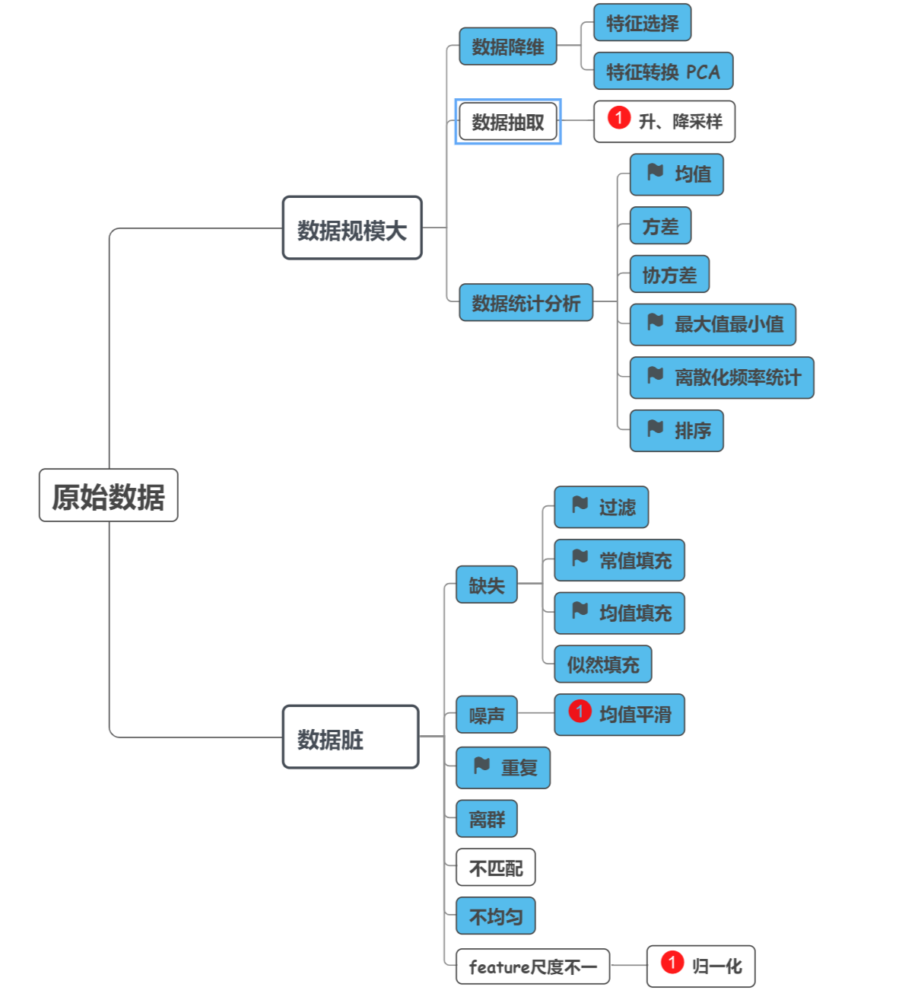

# Outline

在大数据的分析任务中，我们拿到的原始数据往往有着如下两方面的特征：数据规模大、数据”脏“。数据规模大有两方面的含义，一方面是指数据的维数高，另一方面是指样本数量巨大，这两方面的特征意味着我们需要使用分布式、异构等方案加强算力。数据“脏”是指由于采集手段的固有缺憾，我们拿到的原始数据有着部分特征数值缺失（missing）、数据重复（replica）、数据不匹配（incomplete）、噪声（noise）、离群值（outlier）、数据不均（imbalance）的问题，这些问题使得原始数据可靠性很差，会对后续数据挖掘的质量造成很大的不利影响。基于这两方面的特征很有必要探索基于分布式的大数据预处理方案，降低后续分析程序的难度并提升其分析质量。

针对这个任务我们打算按照以下步骤展开工作：

Step1：梳理清楚原始数据可能存在的问题，如上文提到的缺失、噪声等。

Step2：针对每一个可能存在的问题，调研解决问题的预处理算法，比如针对缺失的问题，前人已提出可以使用常值填充、均值填充、最大似然填充、滤除等方案，将这些方案加以梳理。

Step3：在预处理过程中，除了进行数据清洗，数据降维（特征抽取、特征转换等）、样本抽取（应对样本不均）、原始数据统计分析（均值、协方差）等也是常见的处理工作，主流算法需加以梳理。

Step4：确定了问题、算法之后，在网上寻找数据，京东的城市计算、kaggle等平台提供了大量各领域的原始大数据，可以以他们为样本进行实验。

Step5：针对先前梳理的各类算法、采集到的数据，设计分布式程序，测定处理性能，并且将其封装，编写开发文档。



