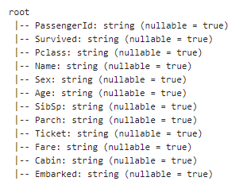

# 数据统计分析

对于新拿到的原始数据，在做数据挖掘或者分析之前，首先需要有一个直观的数据类型与以及统计信息的了解，才有利于进一步的建模以及挖掘，本页文档展示了pyspark处理dataframe数据的一些API函数应用。需要注意的是，zeppelin上注意运行的编译器为%pyspark, 若用java或者scala，代码格式和python略有不同。

本页面上的的代码，可以在[http://10.129.2.159:9090](http://10.129.2.159:9090/)的zepplin平台上运行，欢迎尝试。

## 统计分析

将csv文件读入dataframe

```text
df=spark.read.csv("hdfs://10.129.2.155:50090/123/data/train.csv",header=True)
```

### **1.打印列索引** 

如果datafame有列索引，则会打印其索引标签及数据格式

```python
df.printSchema()
```



### **2.对某一列做数据统计**

选择dataframe的一列，输出其统计信息，包括最大值、最小值等，需要注意的是，mean 、stddev会受null值的影响。

```text
df.describe("Survived").show()
```


### **3.统计缺失率**

对整个dataframe的列做数据缺失率统计，如果缺失率过高可以删除整列。

```text
import pyspark.sql.functions as fn 
# 因为spark没有现成的函数，需要自己利用function函数计算
df_miss=df.agg(*[ (1-fn.count(c)/(fn.count('*'))).alias(c ) 
                for c in df.columns ]) 
df_miss.show()
```


### **4.统一某一列缺失的个数**

选择数据的某一列，统计缺失个数，想要统计整张表格，则模仿上3，写一个for循环

```python
#选择一列利用filter函数统计
df.select("Age").filter("Age is null").count()
# 统计整张表格数据缺失个数
import pyspark.sql.functions as fn
df2=df.agg(*[(fn.count("*")-fn.count(c)).alias(c)
            for c in df.columns])
df2.show()
```

### **5.求众数**

spark中有许多基本的函数，可以根据数学表达式结合排序求得想要的结果，需要注意的是只能做一列统计，暂时没有这个dataframe的API

```text
# spark只能对某一列做统计，选中一列
df_most=df.select("Age").groupBy("Age").count().orderBy("count",ascending=False) 
df_most.show()
```


### **6.求最大最小值**

求解最大最小值的方法有许多：可以直接利用自带的describe函数（官方不推荐），也可以构造临时表利用sql语句计算，还可以将dataframe转换成RDD，然后利用数组求解，需要注意的是数据的格式问题。

```text
# # Method 1: Use describe()
# float(df.describe("Age").filter("summary = 'max'").select("Age").collect()[0].asDict()['Age'])

# # Method 2: Use SQL
# df.registerTempTable("df_table")
# spark.sql("SELECT MAX(Age) as maxval FROM df_table").collect()[0].asDict()['maxval']

# #Method 3: Use groupby()
# df.groupby().max("Age").collect()[0].asDict()['max(A)']//不太好用

# # Method 4: Convert to RDD
# df.select("Age").rdd.max()[0]

# # Method 5: Convert to RDD
max(df.select("Age").collect())
```

### **7.删选信息**

碰到某些条件需要删选，可以借助filter函数，类似于sql的between 和 where

```text
df.filter(df["Age"]>24).show()
```

### **8.groupBy+count**

想要做一些个性化的统计，利用groupBy和count，这个和pandas库用法一样

```text
df.groupBy("Sex").count().show()
```

### **9.sort and orderBy**

sort and orderBy用法和pandas，其中spark默认的是升序排列

```text
df.sort(df["Fare"], ascengding=True).show()
```

### **10.null值的填充**

对于缺失值的填充，可以借助fillna函数或者 na.fill\(\)函数，可以对整张表，也可以选取一列，填入某个特定值，值的选取可以结合前面的最大值，最小值，均值，众数来选取。

```text
df1=df.fillna({"Age": 20})
df1.show()
```

### 11.更改列数据类型

dataframe数据读进来默认为string，可以利用spark.sql可以做如下类型转换：

```text
# 更改列数据类型，首先需要对null值填充，不然会报错
df1=df.fillna({"Age":0})
# 导入如下数据类型的两个包
from pyspark.sql.types import IntegerType
from pyspark.sql.types import FloatType
# 只能对一列一列做更改
df1 = df1.withColumn("Age", df1["Age"].cast(IntegerType()))
df1=df1.withColumn("Fare",df1["Fare"].cast(FloatType()))
df1 = df1.withColumn("Survived", df1["Survived"].cast(IntegerType()))
df1.show()
```


